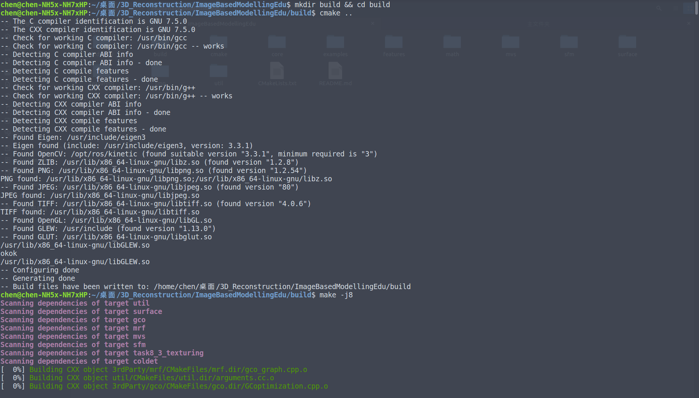
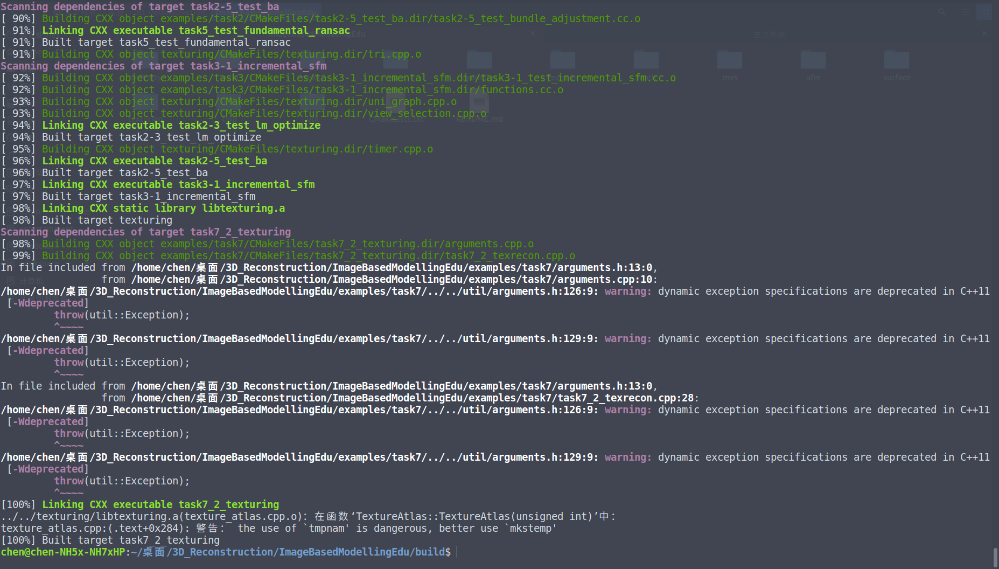
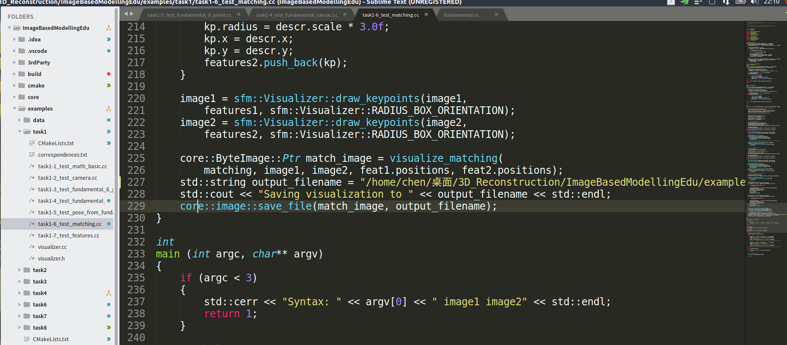
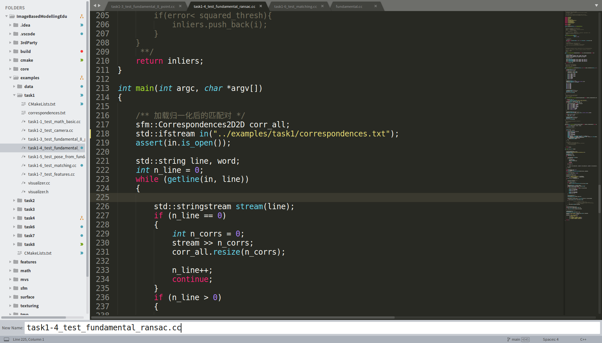
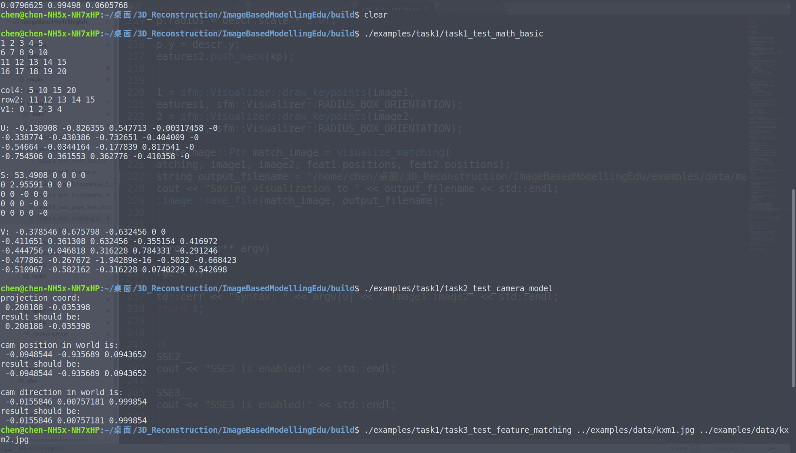
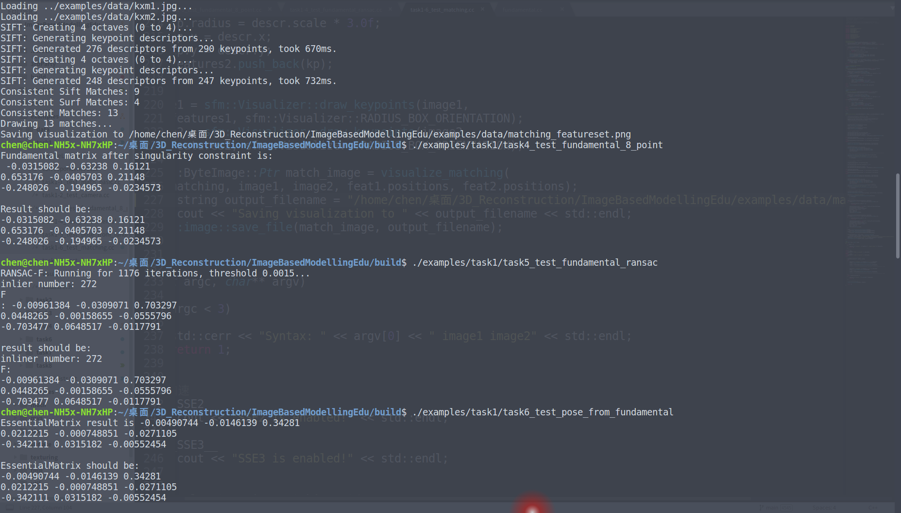

# Ubuntu下环境配置

1. 安装依赖

   ```bash
   sudo apt-get install libjpeg-dev
   sudo apt-get install libtiff-dev
   # 安装Eigen，可以选择低一点的版本，我自己用的是3.3.1
   git clone https://github.com/eigenteam/eigen-git-mirror.git
   mkdir build
   cd build
   cmake  ..
   sudo make install
   sudo cp -r /usr/local/include/eigen3 /usr/include 
   cd 
   ## 下面两个部分由于我之前安装过了，所以不是很确定，大家根据编译时候的提示安装就好，实在不行百度一下。
   # opegl安装。
   sudo apt-get install build-essential
   sudo apt-get install libgl1-mesa-dev
   sudo apt-get install libglu1-mesa-dev
   sudo apt-get install freeglut3-dev
   # glew安装，在16.04测试正常，其他的可以百度一下或者去官网看看
   sudo apt-get install libglew-dbg libglew-dev libglew1.13 libglewmx-dbg libglewmx-dev libglewmx1.13 glew-utils 
   ```

2. 执行命令：

   ```bash
   git clone https://github.com/weisui-ad/ImageBasedModellingEdu.git
   cd ImageBasedModellingEdu
   mkdir build && cd build
   cmake -DCMAKE_BUILD_TYPE=Release .. 
   make -j8 //-j+数字表示编译所用的核心数，根据自己电脑的能力来设置
   ```

   

   

3. 细节：在第一次作业中，有一些硬地址需要手动修改：

   `task1-6_test_matching.cc`：227行左右

   

   `task1-4_test_fundamental_ransac.cc`中218行左右

   

   相对绝对路径都行，推荐绝对路径。也可以修改代码使用传参的形式（如task3那样）。

   以后的作业也有类似路径修改的问题，**将不会重复说明此问题**。

4. 使用

   ```bash
   ## 在build文件夹下
   ./examples/task1/task1_test_math_basic
   ./examples/task1/task2_test_camera_model
   ./examples/task1/task3_test_feature_matching ../examples/data/kxm1.jpg ../examples/data/kxm2.jpg 
   ./examples/task1/task4_test_fundamental_8_point 
   ./examples/task1/task5_test_fundamental_ransac 
   ./examples/task1/task6_test_pose_from_fundamental 
   ```

   

   

