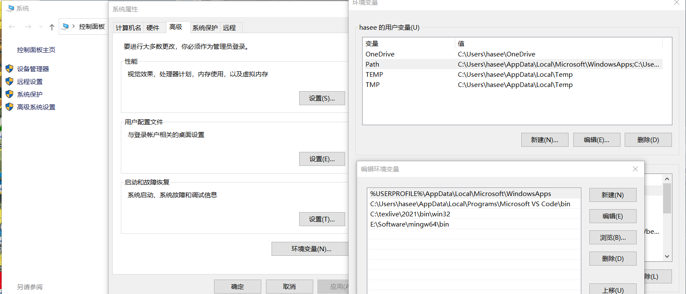
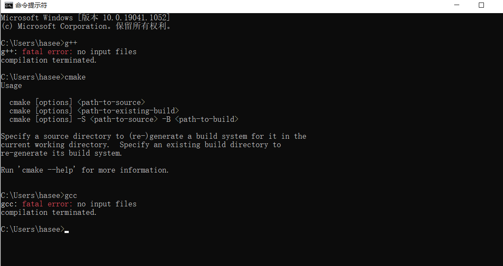
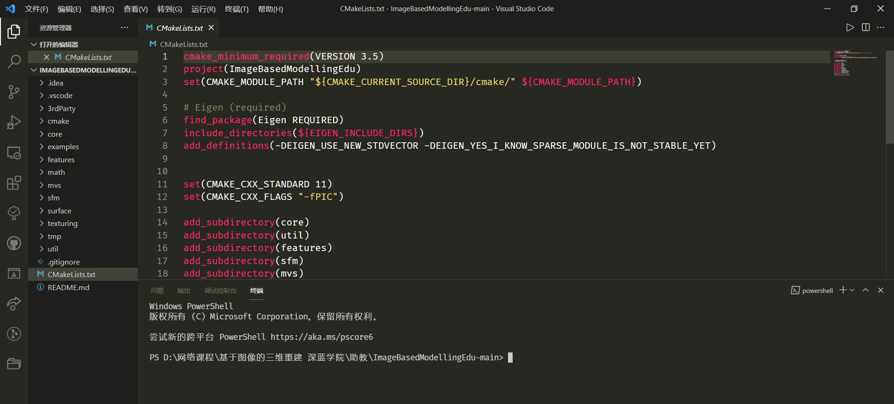
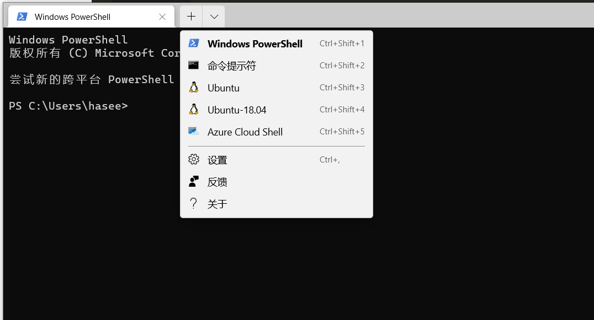

## 安装教程

### 一、windows下编译

1. 下载mingw64和cmake-3.17.0-rc3-win64-x64到单独的文件夹，然后将文件拷贝至`C:\Program Files`下。

2. 此电脑，点击属性，高级系统设置，环境变量，用户变量中双击path

   

   将`C:\Program Files\cmake-3.17.0-rc3-win64-x64\cmake-3.17.0-rc3-win64-x64\bin`和`C:\Program Files\mingw64\mingw64\bin`填入，确认。

3. 验证：

   

   出现上述命令表示成功。

4. 下载eigen-3.3.9，重命名为Eigen。然后将文件拷贝至`C:\Program Files`下。

5. 下述以vscode为例，假设读者已经安装和配置了vscode相关插件（和c++相关），如果有不懂得可以百度。

   在vscode中打开`ImageBasedModellingEdu`，打开终端（注意是 powershell环境）

   

   注：由于版本不同和插件不同可能导致界面有一点差异，不影响大体。

   输入：

   ```
   mkdir build
   CMake -G "MinGW Makefiles" ../
   mingw32-make.exe
   ```

注：部分情况下png和zlip库需要手动安装，详情可以参考官网。

## 二、WSL2方案（推荐）

1. 以管理员权限打开powershell，输入下述命令后重启

   ```powershell
   dism.exe /online /enable-feature /featurename:Microsoft-Windows-Subsystem-Linux /all /norestart
   dism.exe /online /enable-feature /featurename:VirtualMachinePlatform /all /norestart
   ```

2. 在链接中下载linux内核：[链接](https://docs.microsoft.com/en-us/windows/wsl/install-win10#step-4---download-the-linux-kernel-update-package)

3. `powershell`输入`wsl --set-default-version 2`

4. **安装Linux发行版**：打开微软[官方商店](https://aka.ms/wslstore)，搜索并下载ubuntu18.04版本（20.04也行）。安装，启动。

5. （可选）微软官方还推荐了一款`Windows Terminal`颜值很高，也可以在商店下载，并且很方便，颜值很高。在这上面可以比较简单的启动ubuntu。

   

6. 如果不安装上述终端的话，也可以直接搜索应用打开。打开后会要求输入用户名和密码，输入完成后系统（只有命令行没有桌面）就安装完成了。其实用命令行就可以完成编译等一些简单的操作了，如果你还想安装可视化的界面，请看下面操作步骤：

7. 首先换源，更换语言，更新balabala，同普通linux一样。然后：

   ```bash
   sudo apt-get update && sudo apt-get --assume-yes upgrade
   sudo apt-get install --assume-yes xfce4 xorg-dev libopencc2 libopencc2-data libqt4-opengl libqtwebkit4 unzip zip
   ```

8. 接着，参考[博客](https://blog.csdn.net/qq_44554428/article/details/109472954)即可，很详细。

9. 安装图形化界面后，和linux一样了，不过我这边出了点小bug，主要是网络代理不太好装，目前我还没有解决，不过我们可以在window下好传到linux下。在从 WSL 访问 Windows 文件时，可以直接使用`/mnt/{Windows盘符}`进入对应的盘中。

### 三、其他方案：docker

给出一个链接，大家可以参考：[微软官网教程](https://docs.microsoft.com/zh-cn/virtualization/windowscontainers/manage-docker/configure-docker-daemon)，和一些简单的[参考教程](https://www.runoob.com/docker/windows-docker-install.html)。


